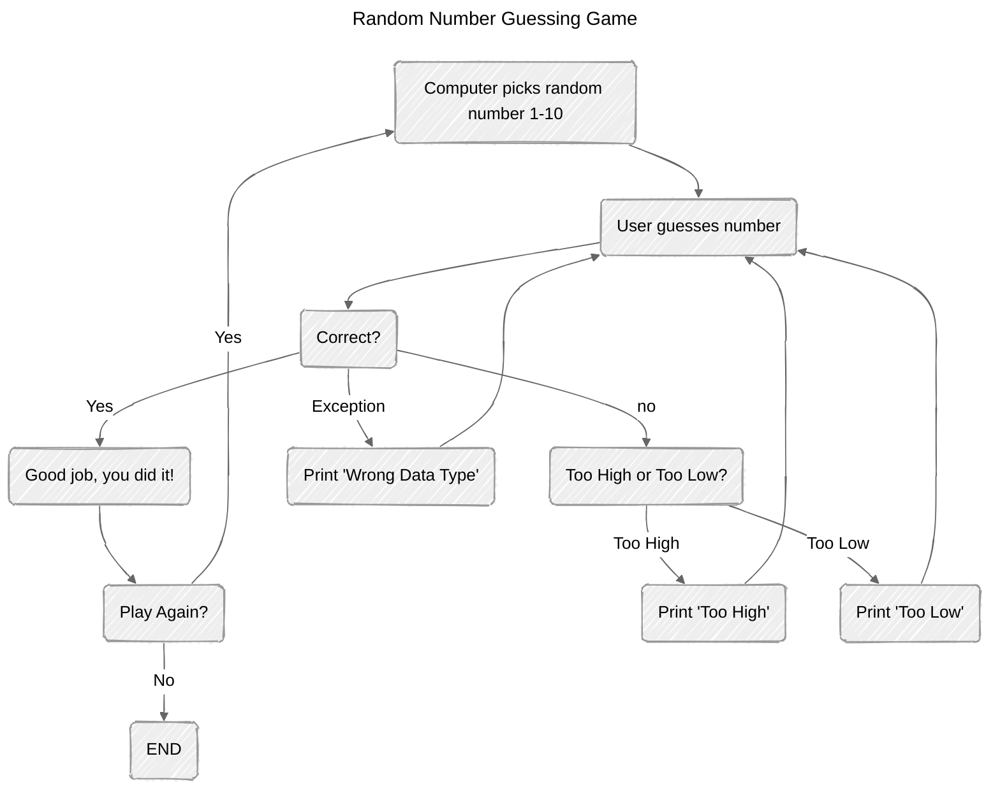

# ABOUT THIS FLOWCHART

* First step is to have the computer pick a number from 1-10  
* The user then guesses what the answer is  
* Is the answer correct?
	* Yes
		* Output "Good Job! Play Again?"
			* Yes - Computer picks a new number.
			* No - Ends the game
	* No
		* Too High or Too Low?
			* Too High - Outputs "Too High" and prompts the user to guess again.
			* Too Low - Outputs "Too Low" and prompts the user to guess again.

	* Exception
		* 